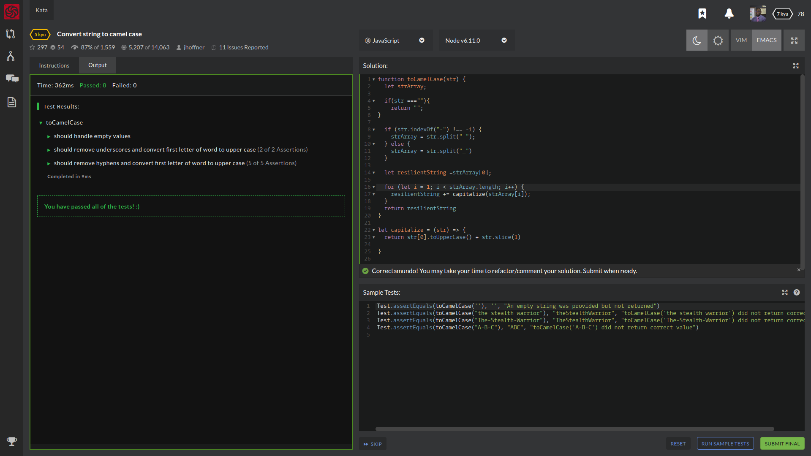

# Kata's For Breakfast, Lunch, and Dinner!
Complete the method/function so that it converts dash/underscore delimited words into camel casing. The first word within the output should be capitalized only if the original word was capitalized.

Examples:

// returns "theStealthWarrior"
toCamelCase("the-stealth-warrior")

// returns "TheStealthWarrior"
toCamelCase("The_Stealth_Warrior")

# ALGORITHMS REGULAR EXPRESSIONS DECLARATIVE PROGRAMMING ADVANCED LANGUAGE FEATURES FUNDAMENTALS STRINGS
Sample Tests:

Test.assertEquals(toCamelCase(''), '', "An empty string was provided but not returned")
Test.assertEquals(toCamelCase("the_stealth_warrior"), "theStealthWarrior", "toCamelCase('the_stealth_warrior') did not return correct value")
Test.assertEquals(toCamelCase("The-Stealth-Warrior"), "TheStealthWarrior", "toCamelCase('The-Stealth-Warrior') did not return correct value")
Test.assertEquals(toCamelCase("A-B-C"), "ABC", "toCamelCase('A-B-C') did not return correct value")

​
## How It's Made
String.prototype.split(), Array.prototype.reverse(),Array.prototype.join(),String.prototype.slice(),String.prototype,
.toUpperCase(), & The for statement

## portfolio:

**WEBSITE:** https:/johnfleurimond.com

## “Happy Codewars! And may the odds be ever in your favor.”
